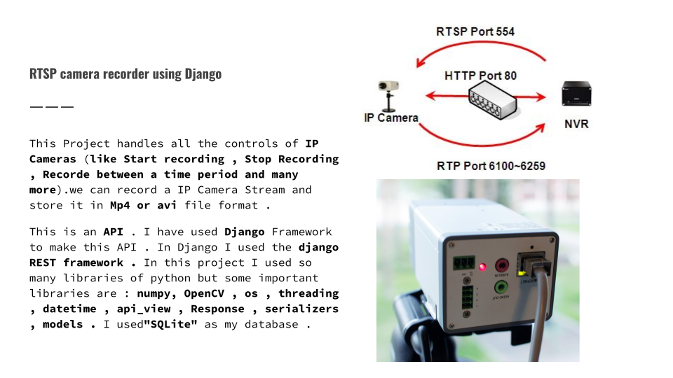

# These are Python Projects.

## First Project


### _*RTSP Recorder*_


#### *purpose*
_*We do a lot of computer vision research! In that, we deal with a lot of CCTV cameras and have data pipelines in place that will record, clean and store video footages coming out of CCTV cameras. The task here is to implement a minified version of the same pipeline.*_


_**Instructions**_
1. first of all install python in case you don't have till now .
2. fire the given commands from terminal :(in case you are on macosx replace pip with pip3 everywhere)
```python
pip install Django 
pip install djangorestframework
pip install opencv-python
pip install numpy
```

_**Instructions That are Required For the Setup**_

1. Install all Required modules mentioned in requirements.txt
2. Django application is in app folder . open a terminal in base directory of application where ```manage.py``` file is located.
3. Fire the command ("python3 ```manage.py``` runserver") in terminal to start the server of our api.


_*Instructions for Using Api*_

In all Requests (POST,PUT,GET) data can be only passed in JSON Formate .(In Get Request You can pass data directally in URL as well.)

1. First of all you should set up a camera in database.
url for adding camera(Request Method : POST) : ```http://127.0.0.1:8000/store_urls"```
data should be passed in this formate (**List of urls): urls = [{
		   "name":camera_name,
		   "url":url_of _camera,
		   "active_hours":"4AM to 9PM"
		}]

2. After adding you can start recording by camera . To start recording you just send a put request to api like bellow.
url for start recording(Request Method : PUT) : ```http://127.0.0.1:8000/start```
to start camera you have to pass name of camera which you want to start you can pass name of camera in request body like this:    
data ={"name":name}
(*** the recording will not stop untill you send a request to stop the camera or Current time will cross the active_hours)

3. To stop camera url is (Request Method : PUT):  ```http://127.0.0.1:8000/stop```
name of camera which you want to stop is passed in request body like this : data ={"name":name}

4. To Check health of camera you can Check single camera's health by passing camera name in request body or if you want to see all camera's health simply pass "all" in request body
url  (Request Method : GET): ```http://127.0.0.1:8000/health_check```
data formate = data ={"name":name} (For all camearas put name=all )


5. To Get all recording url is (Request Method : GET): ```http://127.0.0.1:8000/getpath```
no data will be passed in this request.

6. Corrupt Checker : This will return two lists first will valid videos and second will corrupted videos.
url (Request Method : GET): ```http://127.0.0.1:8000/corrupt_checker```
no data will be passed in this request.

#### **System Architecture**
